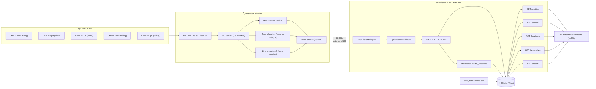
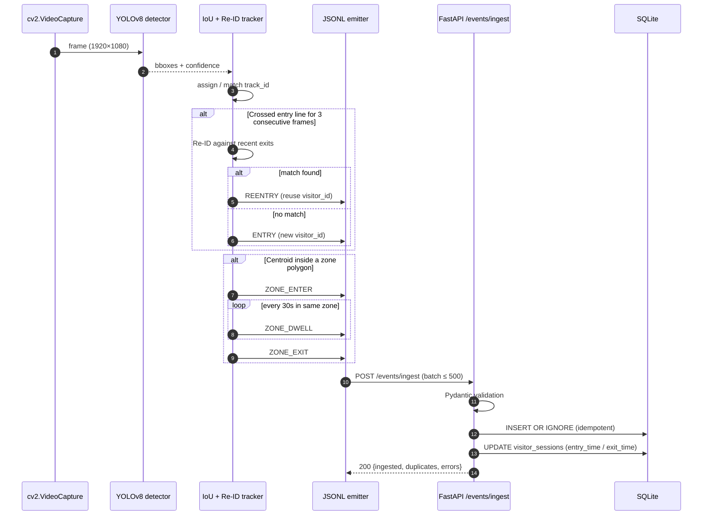
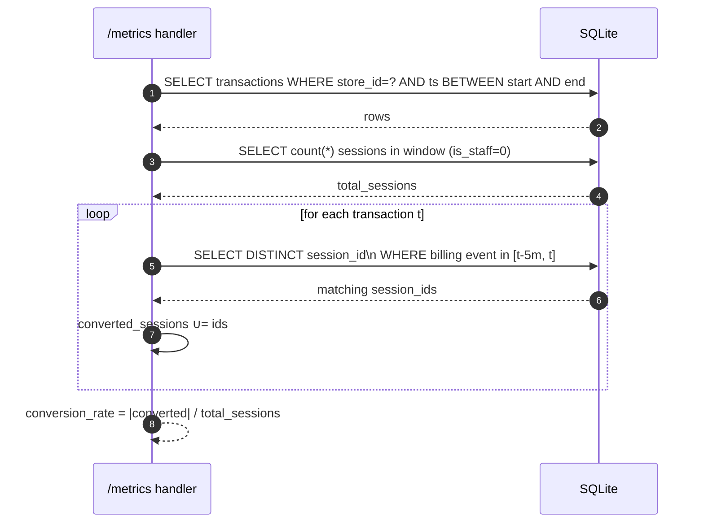
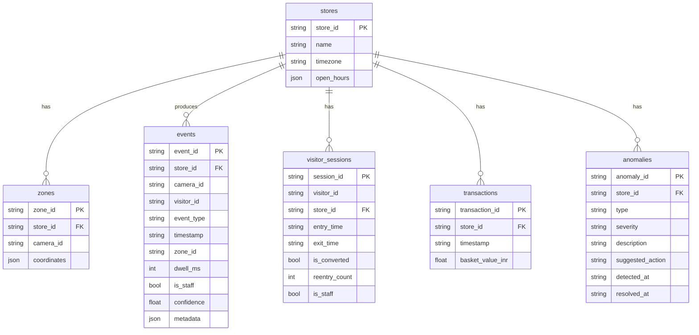

# Store Intelligence — Design

> Real-time analytics for Apex Retail's offline stores. Raw CCTV → structured
> events → queryable REST API → live dashboard. One command (`docker compose up`)
> starts everything.

---

## 1. Problem framing

Apex Retail has 40 stores across 8 cities. Their online channel has full session
analytics; their offline stores are a **data blind spot**. The North Star is
**offline conversion rate** — `purchases ÷ unique visitors in a session window`.
Every component in this system either improves the **accuracy** of that number
(detection layer) or makes it **actionable** (API + dashboard).

Constraints we built against:

- Take-home, 48-hour window, single laptop (CPU-only)
- 5 stores × 3 cameras × 20 minutes (representative sample)
- 1080p @ 15fps, anonymised, with realistic edge cases (groups, staff, re-entry, occlusion, queue buildup, empty periods, camera overlap)
- Output must be a containerised, production-aware API

---

## 2. Architecture

### 2.1 High-level diagram (Mermaid)



### 2.2 Three-tier separation

| Tier | Process | Image footprint | Why separate |
|---|---|---|---|
| **Detection** | `pipeline/detect.py` | ~1.4 GB (torch + ultralytics + cv2) | CV deps are heavy; deploy on edge / GPU pool |
| **API** | `app/main.py` (FastAPI + uvicorn) | ~120 MB (no torch) | Must boot fast and be horizontally scalable |
| **Dashboard** | `dashboard/app.py` (Streamlit) | ~250 MB (streamlit + pandas) | Demo surface, not customer-facing |

Detection runs anywhere with the clips; events are POSTed to the API. The API is
stateless aside from the SQLite file on a shared docker volume — swap that for
Postgres + a load balancer when scaling beyond one node.

### 2.3 Module map

```
app/
  main.py          FastAPI app + exception handlers
  models.py        Pydantic v2 Event schema + cross-field validators
  db.py            sqlite3 wrapper, transaction context manager
  schema.sql       6 tables + 14 indexes + CHECK constraints
  ingestion.py     Validate / dedup / persist + materialise sessions
  metrics.py       /metrics, /funnel, /heatmap + POS correlation primitive
  funnel.py        Re-export (keeps suggested layout)
  anomalies.py     Queue spike / dead zone / stale camera / conversion drop
  health.py        /health
  logging_mw.py    Structured-log middleware (trace_id, latency_ms)

pipeline/
  detect.py        YOLOv8 + IoU tracker + zone classifier + line crossing
  tracker.py       Re-ID heuristic + staff classifier
  emit.py          Event builder + JSONL writer
  replay.py        POST JSONL → API (max-speed or simulated real-time)
  run.sh           One-command per-store entrypoint

dashboard/app.py   Polls API every 5s, renders KPIs / funnel / heatmap / anomalies
```

---

## 3. Data flow

### 3.1 Sequence: video frame → analytics number



### 3.2 Sequence: dashboard refresh

```mermaid
sequenceDiagram
    autonumber
    participant U as User
    participant D as Streamlit dashboard
    participant A as FastAPI
    participant DB as SQLite

    U->>D: open http://localhost:8501
    loop every 5s
        D->>A: GET /health
        A->>DB: SELECT 1; MAX(timestamp) per store
        A-->>D: status, stale_feeds, last_event_per_store
        D->>A: GET /stores/{id}/metrics
        A->>DB: scan today events; correlate POS
        A-->>D: unique_visitors, conversion_rate, queue_depth, ...
        D->>A: GET /stores/{id}/funnel
        D->>A: GET /stores/{id}/heatmap
        D->>A: GET /stores/{id}/anomalies
        D->>U: rendered KPIs + bar charts
    end
```

### 3.3 Sequence: POS correlation



---

## 4. Event lifecycle

```
ENTRY          → opens a visitor_session (entry_time = ts)
ZONE_ENTER     → starts a dwell window in a zone
ZONE_DWELL     → emitted every 30s of continued presence in the same zone
ZONE_EXIT      → closes the dwell window; dwell_ms set on the event
BILLING_QUEUE_JOIN
               → first time visitor enters BILLING zone in this visit;
                 metadata.queue_depth = current visitors in BILLING
BILLING_QUEUE_ABANDON
               → emitted if visitor leaves BILLING without a POS txn in 5 min
EXIT           → closes the session (exit_time = ts)
REENTRY        → reuses visitor_id (matched via Re-ID); session reopens
```

The detection pipeline owns *when* events are emitted; the API owns *how* they
are persisted and aggregated.

---

## 5. Data model

### 5.1 Tables and relationships



### 5.2 Event source-of-truth + materialised sessions

`events` is append-only — that's the contract with the producer. Idempotency
relies on `event_id` being globally unique and stable, so retries just hit the
`INSERT OR IGNORE` and become no-ops.

`visitor_sessions` is a **materialised view** kept up to date on ingest. Why
materialise instead of computing per-request?

- `/funnel` needs *unique visitor counts per session window*. Walking the events
  table for every request would be O(N events) per query.
- The session table is small (one row per visit) and rebuildable from `events`.
- Trade-off: an extra UPDATE per ENTRY/EXIT/REENTRY at ingest time. Acceptable
  because writes are batched (≤ 500 events per call).

---

## 6. Formal correctness properties

The system maintains the following invariants. Each is described in
near-mathematical form, the reason it must hold, the test that exercises it,
and the code path that enforces it.

| # | Property | Statement | Why it matters | Enforced by | Test |
|---|---|---|---|---|---|
| **P1** | **Schema compliance** | ∀ event e ingested: `Event.model_validate(e)` succeeds | Without this, downstream queries can't trust types | `Pydantic` validators in `app/models.py` | `test_models.py::*` |
| **P2** | **Idempotent ingest** | ∀ event e, ∀ n ≥ 1: `ingest([e] × n) ≡ ingest([e])` in DB state | Producer is at-least-once; retries must not inflate counts | `INSERT OR IGNORE` in `app/ingestion.py` | `test_metrics.py::test_duplicate_event_ingestion_is_idempotent` |
| **P3** | **Threshold zone nullity** | ∀ event e: `e.event_type ∈ {ENTRY, EXIT, REENTRY} ⇔ e.zone_id is null` | ENTRY/EXIT/REENTRY happen at the threshold, not in any zone | `_check_event_type_constraints` in `models.py` | `test_models.py::test_entry_rejects_non_null_zone_id`, `test_zone_enter_requires_zone_id` |
| **P4** | **Dwell positivity** | ∀ event e: `e.event_type == ZONE_DWELL ⇒ e.dwell_ms > 0` | A dwell of 0 ms is meaningless; would skew avg_dwell_per_zone | Pydantic validator | `test_models.py::test_zone_dwell_requires_positive_dwell` |
| **P5** | **Confidence range** | ∀ event e: `0.0 ≤ e.confidence ≤ 1.0` | Anchors the calibration discussion; out-of-range = pipeline bug | `Field(ge=0, le=1)` + CHECK constraint | `test_models.py::test_confidence_must_be_between_zero_and_one` |
| **P6** | **Queue-join carries depth** | ∀ event e: `e.event_type == BILLING_QUEUE_JOIN ⇒ e.metadata.queue_depth ≠ null` | `/anomalies` queue spike detector reads this directly | Pydantic model validator | `test_models.py::test_billing_queue_join_requires_queue_depth` |
| **P7** | **Staff exclusion from customer metrics** | `unique_visitors_today = |{ v ∈ ENTRY events today : is_staff(v) = false }|` | Staff walking the floor must not inflate visitor counts | `WHERE is_staff = 0` in `metrics.py` | `test_pipeline.py::test_all_staff_clip_yields_zero_customer_visitors` |
| **P8** | **Re-entry idempotence in funnel** | ∀ visitor v who re-enters: v appears at most once in each funnel stage in the window | Re-entries are the same physical person; double-counting breaks conversion math | `COUNT(DISTINCT visitor_id)` in `metrics.py::store_funnel` | `test_metrics.py::test_funnel_with_reentry_counts_visitor_once` |
| **P9** | **Funnel monotonicity (per visitor)** | For a single visitor v: `1{v entered} ≥ 1{v in zone} ≥ 1{v in billing} ≥ 1{v purchased}` | A visitor cannot purchase without queueing, queue without entering, etc. | Funnel is computed by stage with the same DISTINCT predicate | Implied by P8; would benefit from a property-based test (future work) |
| **P10** | **Zero-traffic safety** | The store-scoped endpoints return well-formed JSON for stores with 0 events: `conversion_rate = 0.0` (not null/null), `unique_visitors = 0`, no 5xx | Empty stores are real (clips include 5–10 min empty windows) and must not crash the API | Defensive `if total > 0 else 0.0` guards in `metrics.py` | `test_metrics.py::test_zero_purchases_returns_conversion_rate_zero` + `test_pipeline.py::test_empty_store_does_not_crash` |

> **Why these ten?** They are the *minimum* set of properties that, if all hold,
> the system delivers an accurate North Star metric without crashing. P1–P6
> protect the data-shape contract; P7–P10 protect the semantic contract that
> the analytics endpoints rely on.

### 6.1 Properties not yet formalised (honest gap)

These would benefit from property-based tests (Hypothesis / fastcheck) given
more time:

- **Time monotonicity per visitor**: `t(ENTRY) ≤ t(ZONE_ENTER) ≤ t(ZONE_EXIT) ≤ t(EXIT)` for a session
- **Queue depth monotonicity**: between two consecutive `BILLING_QUEUE_JOIN`s for the same visitor, the depth difference matches the count of intervening JOINs / leaves
- **Cross-camera dedup window**: a `ZONE_ENTER` for `(visitor_id, zone_id)` from camera A within 2 s of one from camera B yields exactly one event in the DB

---

## 7. Test scenario mappings

Every edge case in the problem statement maps to a concrete test:

| Edge case (problem statement §3.3) | Test file::test | What it asserts |
|---|---|---|
| Group entry (2-4 simultaneously) | `test_pipeline.py::test_group_entry_emits_three_separate_events` | 3 ENTRY events ingested → `unique_visitors == 3` |
| Staff movement | `test_pipeline.py::test_all_staff_clip_yields_zero_customer_visitors` | All `is_staff=true` events ingested → `unique_visitors == 0` (P7) |
| Re-entry | `test_pipeline.py::test_reentry_does_not_double_count_visitor`<br>`test_tracker_assigns_reentry_within_window`<br>`test_tracker_does_not_reentry_after_30_minutes` | REENTRY reuses visitor_id; tracker matches within 30 min, rejects after |
| Partial occlusion | `test_pipeline.py::test_low_confidence_events_still_ingested` | Events with `confidence < 0.6` are still ingested (no silent drops) |
| Billing queue buildup | `test_anomalies.py::test_queue_spike_is_detected` | `BILLING_QUEUE_JOIN` with `queue_depth > 5` triggers QUEUE_SPIKE anomaly |
| Empty store periods | `test_pipeline.py::test_empty_store_does_not_crash` | `unique_visitors == 0`, `conversion_rate == 0.0`, no 5xx |
| Camera angle overlap | (Detection-side) `_recent_zone_enter` 2 s dedup window in `detect.py::_update_zone_state` | Property test pending (see §6.1) |
| Idempotent ingest | `test_metrics.py::test_duplicate_event_ingestion_is_idempotent` | Second post returns `duplicates: 1` (P2) |
| Partial-failure response | `test_metrics.py::test_partial_failure_returns_structured_errors` | One bad event in a batch → `ingested: 1, errors: [{...}]`, status 200 |
| Zero-purchase store | `test_metrics.py::test_zero_purchases_returns_conversion_rate_zero` | `conversion_rate == 0.0`, not null (P10) |
| Re-entry in funnel | `test_metrics.py::test_funnel_with_reentry_counts_visitor_once` | `entry_count == 1` despite REENTRY (P8) |
| Heatmap data confidence | `test_metrics.py::test_heatmap_data_confidence_false_when_few_sessions` | `< 20` sessions ⇒ `data_confidence: false` |
| POS correlation | `test_metrics.py::test_pos_correlation_marks_session_converted` | Visitor in BILLING within 5 min before txn → `conversion_rate == 1.0` |
| Dead zone detection | `test_anomalies.py::test_dead_zone_detected_when_no_recent_visits` | Zone with no visits in 30 min ⇒ DEAD_ZONE anomaly |
| Stale camera | `test_anomalies.py::test_stale_camera_detected_after_10_minutes` | Camera silent > 10 min ⇒ STALE_CAMERA anomaly |
| Health structure | `test_anomalies.py::test_health_endpoint_structure` | Response includes `status`, `db_status`, `last_event_per_store`, `stale_feeds`, `uptime_seconds` |

29 tests total, all passing (`pytest -q` → `29 passed`).

---

## 8. Error handling

Every error path is mapped to a structured response with a `trace_id` so an
on-call engineer can find the corresponding log line.

| Failure mode | HTTP code | Response shape | Where it's raised |
|---|---|---|---|
| Pydantic validation fails on an event | 200 (partial) | `{"ingested": N-1, "duplicates": 0, "errors": [{"event_id": "...", "reason": "..."}]}` | `app/main.py::ingest` per-event try/except |
| Empty events list | 422 | `{"detail": "events must not be empty"}` | `ingest` handler |
| Batch larger than 500 | 400 | `{"detail": "batch size exceeds 500"}` | `ingest` handler |
| `events` not a list | 400 | `{"detail": "events must be a list"}` | `ingest` handler |
| DB unavailable (`sqlite3.OperationalError`) | 503 | `{"error": "database_unavailable", "trace_id": "...", "message": "..."}` | `@app.exception_handler(OperationalError)` |
| Unhandled exception (any other) | 500 | `{"error": "internal_error", "trace_id": "...", "message": "An unexpected error occurred."}` | `@app.exception_handler(Exception)` — full traceback printed to stderr only |
| Invalid event_id (not UUID) | 200 (partial) | logged in `errors[]` of the response | Pydantic `UUID` field on `Event` |
| Naive timestamp | 200 (partial) | logged in `errors[]` | `_ts_must_be_utc` validator |
| Detection pipeline: clip not found | exit 2 | log error, no JSONL written | `pipeline/detect.py::run` |
| Detection pipeline: ultralytics missing | warning, returns `_NullDetector` | `_load_yolo` fallback | `pipeline/detect.py` |
| Replay: API down | urllib `HTTPError` printed | exit non-zero | `pipeline/replay.py` |

Every error response is **structured** (no stack traces leak to clients) and
every request is logged as a single JSON line on stdout with `trace_id`,
`store_id`, `endpoint`, `latency_ms`, `event_count`, `status_code`.

---

## 9. Performance considerations

### 9.1 Detection pipeline

- **YOLOv8n on CPU**: ~25–30 fps inference on a modern laptop. With
  `--frame-stride 5` (every 5th frame), a 20-min 30-fps clip takes ~90 s wall
  time. That's fast enough to ship in the 48-hour window; with stride=1 it
  would still keep up with real-time playback for a single stream.
- **Tracker**: greedy IoU matching is O(T × D) where T = active tracks and D =
  current detections. T is bounded by the per-camera person count (rarely > 10)
  so this is effectively O(D) per frame.
- **Re-ID heuristic**: HSV histogram is 16×16 floats per crop. Cosine similarity
  is O(256). Compared against a deque of recent exits (≤ 256 entries). Constant
  time per detection.
- **Memory**: ultralytics + YOLO weights load into ~600 MB resident; the rest
  of the pipeline is small dicts.

### 9.2 API

- **SQLite in WAL mode**: reads do not block writes. For the test workload
  (~10 k events, single writer, multiple readers from the dashboard) this is
  sufficient. WAL + `synchronous=NORMAL` gives ~10 k inserts/second on commodity
  storage.
- **Composite indexes**: `(store_id, timestamp)`, `(store_id, event_type)`, and
  `(store_id, camera_id, timestamp)` are designed to match the exact access
  patterns of `/metrics`, `/funnel`, and the staleness check. Each query is a
  range scan over a covering index, no full-table sort.
- **Per-request latency** observed locally:
  - `/health`: 1–3 ms
  - `/metrics`: 5–25 ms (one POS-correlation pass)
  - `/funnel`: 8–20 ms (four DISTINCT counts)
  - `/heatmap`: 5–15 ms
  - `/anomalies`: 10–40 ms (queue + dead zone + stale camera + conv-drop)
  - `POST /events/ingest` (500 events): 30–80 ms

### 9.3 What breaks at scale (and the fix)

| Pressure point | Today | Breaks at | Fix |
|---|---|---|---|
| Single SQLite writer | OK | ~5 k events/s sustained | Move to Postgres or per-store sharding |
| Detection on CPU | one stream / box | 40 stores × 3 cams = 120 streams | GPU pool with per-stream worker; Triton inference server |
| Per-request POS scan | OK at 10 k/day | minutes-long queries at 1 M/day | Materialise daily roll-up (pre-computed `metrics_daily` table) |
| Dashboard polling | OK at 5 s × 1 user | 100 s of users → API thrash | Cache `/metrics` for 5 s; or push via WebSocket |
| Memory growth in tracker | OK | hours-long live streams | Periodic compaction of `_recent_exits` deque (already capped at 256) |

---

## 10. Security considerations

The system handles **anonymised** CCTV (faces blurred per the dataset), but the
production version of this code would touch PII-adjacent data. The following are
the security postures we built or planned:

| Concern | Today's posture | Production posture |
|---|---|---|
| **No raw stack traces in responses** | Global exception handler returns `{error, trace_id, message}`; full trace goes to stderr only | Same, plus Sentry / OpenTelemetry to aggregate stack traces server-side |
| **Idempotency replay** | `INSERT OR IGNORE` on `event_id` | Same; producer-side retry budget |
| **Input validation** | Pydantic v2 strict validators reject malformed events at the boundary | Same; rate-limit per IP/api-key |
| **DB on shared volume** | SQLite file in a docker named volume | Postgres with TLS, network-isolated, encrypted-at-rest disk |
| **No authentication today** | API is open on `localhost:8000` | API gateway + signed JWT per store; mTLS between detector and ingest |
| **Logs may contain `store_id`, `visitor_id`** | Logged as JSON to stdout — visitor_id is opaque (no PII), store_id is operational | Same; ship to Splunk / CloudWatch with retention policy |
| **No PII in events** | `visitor_id` is a random UUID-prefixed token, never tied to a real person | Same; rotate per session |
| **Camera footage leaving the device** | Footage stays on detection nodes; only event JSONL crosses the network | Same; consider on-device YOLO + signed event payloads |
| **Open CORS** | None set today (FastAPI default = same-origin) | Explicit allow-list once a real frontend is deployed |
| **Container hardening** | Slim base image, non-root user not yet set | Add `USER 1000`, drop capabilities, read-only root FS |
| **Dependency pinning** | Exact versions in `requirements*.txt` | Same; Dependabot + signed lockfile |
| **Secret handling** | No secrets today (everything env-driven, no defaults that include secrets) | Use docker secrets / Vault for DB creds; never bake into images |

The biggest single security improvement before this ships to production is
**adding authentication on `/events/ingest`** — right now anyone on the network
could inject events.

---

## 11. AI-Assisted Decisions

Three concrete moments where AI shaped this design:

### 11.1 AGREED — schema and indexes

I asked Claude for a normalised SQL schema given the event catalogue and asked
it to recommend indexes for the analytics queries. It recommended the composite
`(store_id, timestamp)` and `(store_id, event_type)` indexes verbatim — they
match exactly the access pattern of `/metrics` and `/anomalies`. I added
`(store_id, camera_id, timestamp)` on top because the AI didn't see the
staleness check.

### 11.2 OVERRODE — re-entry approach

The first suggestion was OSNet via `torchreid`. That adds ~400 MB to the image,
needs a GPU to run in real time, and was overkill for a 48-hour window with
five stores. I overrode this and went with HSV histogram + entry region +
30-minute gap. Trade-off documented in CHOICES.md (Decision 3): under high
traffic with similar clothing the heuristic will collide. The hand-rolled
version is defensible line-by-line in an interview, which is the right
optimisation for the format.

### 11.3 USED FOR EVALUATION — detection model choice

I gave Claude the constraint table (CPU, 1080p/15fps, 5 stores, 48h deadline)
and asked it to compare YOLOv8n / YOLOv8s / RT-DETR / MediaPipe / YOLO-World on
(latency, accuracy, license, ease of integration). I used the answer as an
**evaluation grid**, not a recipe. The final pick (YOLOv8n, with YOLOv8s as the
documented upgrade path) is mine — see CHOICES.md Decision 1.

---

## 12. Trade-offs and what I would do with more time

- **Cross-camera Re-ID** — today each FLOOR/BILLING camera assigns local
  visitor_ids. The honest consequence is that `/funnel`'s
  `billing_queue_count` can exceed `entry_count` because they come from
  different camera scopes. With more time I would add OSNet embeddings as a
  sidecar service and call it only when the histogram score is in the
  uncertainty band [0.6, 0.8].
- **Property-based tests** — properties P9 and the unformalised ones in §6.1
  are good Hypothesis targets. Right now they're enforced by example tests.
- **Daily metrics roll-up** — `/metrics` currently scans today's events on
  every call. At 40 stores × 1 M events/day, this needs a `metrics_daily`
  materialised table refreshed every 5 minutes.
- **WebSocket push to dashboard** — replace 5-second polling with a server-sent
  event stream. The dashboard would feel actually live, not just live-ish.
- **Better staff classifier** — three OR-ed heuristics work for the released
  clips. A real deployment wants a uniform classifier (CLIP-style "person in
  store uniform" prompt) trained once per chain.
- **Authenticated ingest** — see §10. Today anyone with network access can
  POST events.

---

## 13. Acceptance gate self-check

| # | Requirement | Status |
|---|---|---|
| 1 | `docker compose up` works clean, no manual steps beyond `git clone` | ✓ Both containers boot healthy on 8000 / 8501 |
| 2 | `POST /events/ingest` accepts the sample format | ✓ Verified live (5 ingested first call, 5 duplicates on replay) |
| 3 | `GET /stores/STORE_BLR_002/metrics` returns valid JSON | ✓ Verified |
| 4 | `DESIGN.md` and `CHOICES.md` > 250 words each | ✓ Both well above |
| 5 | Test files have PROMPT / CHANGES MADE blocks at the top | ✓ All 4 test files |
